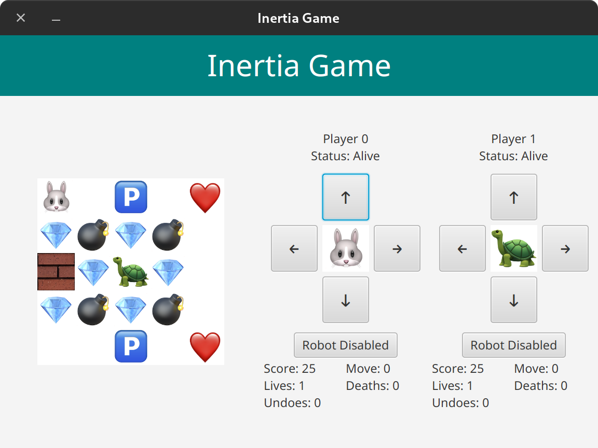

# Inertia Java FX Game with Multithreading Extension

Inertia is a puzzle game, originally implemented by Ben Olmstead. The objective of this game is to collect all gems without running into mines, with the added twist that you will not stop once you start moving until you hit either a wall, a "stop cell", a mine, or the border of the game board.

An online demo of the game can be found [here](https://www.chiark.greenend.org.uk/~sgtatham/puzzles/js/inertia.html).


## User Story


- First, the user runs the game and sees the main menu, which contains the name of the game and a button for loading the game from a file.

- Then the user clicks on the [Load Game] button and an open file dialog will show up to prompt the user to choose a saved game file.

  - If the user clicks on the [Cancel] button of the dialog, an alert showing that the user has cancelled selecting a file will pop up.
  - If the there is an error loading the file selected by the user, an alert showing that there is an error when loading the game file will pop up.

- If the game file is loaded successfully, the user will be navigated to the game play interface, which consists of three areas: the game board showing the status of the game, the control area for operating the game, and the statistics panel showing the numeric information.

- Then the user clicks on the buttons in the control area to play the game.

- If the user wins or loses the game, the corresponding alert will be shown

- The user will be navigated back to the main menu after the alert is closed.

  

## Game Elements

There are two types of game elements: Cells and entities.

### Cells

Cells are the components that make up a game board. Each cell represents a single tile on the game board.

Cells are categorized into the following types:

- `Wall`: A cell that the player cannot directly move/slide past.
- `EntityCell`: A cell that can house an entity.
- `StopCell`: An `EntityCell` that causes the player to stop "sliding".

### Entities

Entities are objects that can reside on an entity cell.

Entities are categorized into the following types:

- `ExtraLife`: Picking up of this entity will increase the number of lives of the player.
- `Gem`: Picking up of this entity will enable the player to collect a gem.
- `Mine`: Crossing over of this entity will cause the player to lose a life.
- `Player`: That's you (or a computer)


## Game Mechanics

### Basic Controls

- `up`/`down`/`left`/`right`: Moves the player in the specified direction
- `quit`: Quits the game
- `undo`: Undoes a move

### Game Rules

- When the player moves in a direction, they will "slide over" each cell of the given direction until the next adjacent cell is a wall or would be outside the game boundaries.

  Consider the following example:

  ```
  @........  ->  #.......@
  ```

  When the player moves to the right, the player will step on each cell, until the player reaches the end of the row and stops.

  ```
  @...W...  ->  #..@W...
  ```

  Similarly, when the player moves to the right, the player will step on each cell. However, once the player reaches (0,3), since the adjacent cell is a wall, the player cannot move past it, and so it will stop there.

- A player can also stop if it passes through a "stop cell".

  ```
  @...#...M  ->  #...@...M
  ```

  When the player moves to the right, the player will move across each cell until it reaches the "stop cell" at (0,4).

- A player will pick up all entities of cells they passed through. An exception to this rule is when the player dies while making this move.

  ```
  @********#  ->  #........@
  ```

  When the player moves to the right, the player collects the gems of each cell they pass through.

- If a player moves in a direction that cannot be moved in (for instance because there is a wall or it would go outside of the game board boundaries), the move is considered to be an invalid move.

  ```
           Move=RIGHT
  @W*      --------->  @W*
  ...                  ...
  Moves=0              Moves=0
  ```

  In the example, when the player tries to move to the right, they are blocked by the wall. Therefore, this is considered as an invalid move, and the number of moves will not increment in this case.

  Note that this only applies when the player tries to move in the direction whose adjacent cell is invalid. In other words, this rule only applies if the player does not move anywhere:

  ```
           Move=RIGHT
  @.W*     --------->  #@W*
  ....                 ....
  Moves=0              Moves=1
  ```

- If a player passes through a mine while moving in a direction, they instantly die. All entities collected during the move is invalidated, meaning that it is treated as if the player did not pick them up.

  ```
  @.*.M    ->  ....X  -> @.*.M
  Lives=3                Lives=2
  Deaths=0               Deaths=1
  Moves=0                Moves=1
  ```

  When the player moves to the right, the player will pick up the gem in (0,2), and proceed to be blown up by the mine in (0,4). Therefore, the move is rolled back, and the number of deaths of the player is incremented by one. The number of moves is also incremented by one, since this move is considered as a valid move (despite resulting in the player's death).

  If the player has surplus lives, the number of lives is decremented by one.

### Undo

The undo functionality undoes a single step made by the player. All game state is restored by the undo logic, including:

- The position of the player
- The number of lives of the player (if extra life(s) were picked up)
- The entities which existed before the move was made, if any

For example:

```
          Move             Undo
@L*.#.M   --->  #...@.M    --->  @L*.#.M  
Lives=2         Lives=3          Lives=2
Moves=0         Moves=1          Moves=1
```

### Winning and Losing Conditions

The game is won when all gems are collected from the game board.

The game is lost when the player runs out of lives. This means that if the player has an unlimited number of lives, the game will never be lost ~~(unless the player quits in frustration)~~.


## Loading a Game

The game *must* be launched with an argument specifying the game file to load.

Several puzzles are provided for you under the directory `puzzles`.

### Designing Custom Games

The format of each game file is as follows:

```
<number of rows>
<number of columns>
<number of lives; may be blank for unlimited>
<row 1 cells>...
<row 2 cells>...
...
```

Note that the representation of these cells are (yet again) different from the ones used for display:

- `W`: Wall
- `L`: Extra Life on an `EntityCell`
- `G`: Gem on an `EntityCell`
- `M`: Mine on an `EntityCell`
- `P`: Player on a `StopCell`
- `S`: A blank `StopCell`
- `.`: A blank `EntityCell`

See the `puzzles` directory for examples.


## Multiplayer Extension

### Multiplayer

Multiple players are allowed in a game. Note that the number of players can be `>=1` (can be more than 2). 

### Manual Control and Robot

In addition to manually controlling players by clicking buttons, I introduce automated robots to control the players. 


As shown in the screenshot of the GUI program , each player has its own control buttons, as well as a `Robot Disable/Enabled` button. 
When `Robot` is enabled, all control buttons are disabled and the player is controlled by an instance of `Robot`.
The robot can be disabled at any time to revoke manual control.

### Multithreading

Each robot runs in a separate thread. As a result, there can be multiple threads concurrently moving players on the game board. The robots move players in separate threads and there is also a main thread of JavaFx that updates the GUI.

- Each gem and extra life can only be collected by one player.

- Players do not move pass each other, e.g., `Wp...PW` should not end up in `WP...pW`.
